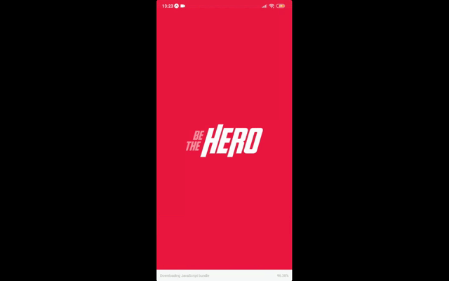

# Projeto - Be the hero

O Be The Hero é um projeto que visa conectar pessoas dispostas a ajudar ONGs.

## Tecnologias utilizadas

### Backend

- Linguagem: `NodeJS`
- Criação de API: `Express`
- SQL Builder: [`KnexJS`](http://knexjs.org/)
- Banco de dados: `SQLite 3`
- Validação de dados: [`Celebrate`](https://github.com/arb/celebrate)
- Criação de variáveis de ambiente: [`Cross env`](https://github.com/kentcdodds/cross-env)
- Documentaçao de requisiçoes: [`Postman`](https://www.postman.com/)
  - Importar link: https://www.getpostman.com/collections/8462d31b576e30d0fa59

### Frontend

- Biblioteca: `React`
- Criação de rotas: `React Router`
- Estilização: `CSS`
- Comunição com API: `Axios`

### Mobile

- Biblioteca: `React Native`
- Ferramenta: `Expo`
- Navegação entre paginas: `React Navigation`

### Testes Unitátios e Integração

- [Testes com TDD - Youtube](https://www.youtube.com/watch?v=2G_mWfG0DZE)

#### Unitátios

- Biblioteca: [`Jest`](https://jestjs.io/)
  
#### Integração

- Biblioteca: [`Supertest`](https://github.com/visionmedia/supertest)
